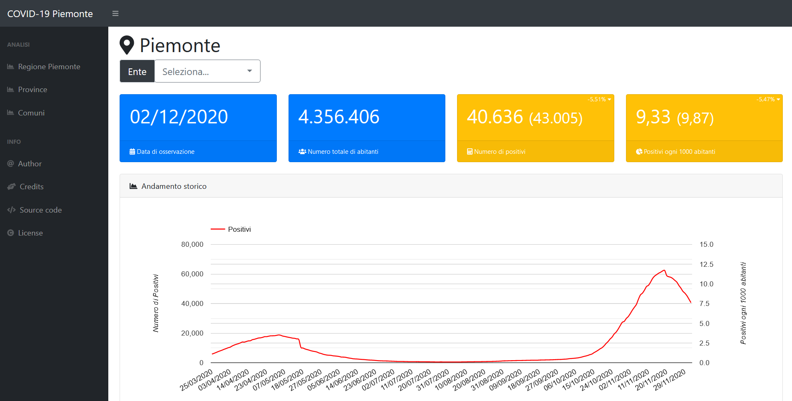

# covid-19-piemonte

Lo scopo di questo progetto è quello di cercare di migliorare la fruibilità dei dati generati dagli enti pubblici del Piemonte in merito ai casi positivi COVID-19 nei comuni della Regione.

## Funzionalità

Il sito permette di poter visualizzare le informazioni aggregate per:

- Regione
- Provincia
- Singolo comune

Nelle visualizzazioni per Regione e Provincia è possibile anche consultare le informazioni relative al totale dei positivi per Provincia, l'elenco dei primi 10 Comuni per positivi su 1000 abitanti, nonché l'elenco dei primi 10 Comuni per totale assoluto di positivi.

## Origine dei dati

Dal mese di marzo 2020 la Regione Piemonte pubblica alla pagina [https://www.regione.piemonte.it/web/covid-19-mappa-dei-contagi-piemonte](https://www.regione.piemonte.it/web/covid-19-mappa-dei-contagi-piemonte) una mappa coropletica con il numero dei positivi per singolo comune. Muovendo il mouse sulla mappa, è visualizzato il numero di positivi per il comune corrispondente alla data di aggiornamento della mappa.

Considerata la scarsa fruibilità e leggibilità delle informazioni così esposte, sono nati alcuni progetti che si sono adoperati per rilasciare i dati relativi alla pandemia in formato aperto, cioè: in formato **machine readable**, con **licenza aperta**, **certificati**, **completi**, il più possibile **disaggregati**, **aggiornati** e con lo **storico** dei dati nel tempo.

I repository identificati per la realizzazione di questo progetto sono:

- Per i dati storici: [https://github.com/to-mg/covid-19-piemonte](https://github.com/to-mg/covid-19-piemonte)
- Per i dati relativi al giorno corrente: [https://github.com/floatingpurr/covid-piemonte](https://github.com/floatingpurr/covid-piemonte)

## Configurazione

Tramite il file `config.php` è possibile personalizzare la propria installazione e definire la corretta sorgente dei dati:

|Nome della costante|Descrizione|
|------|-------|
|`_ENV`|[`dev` \| `prod`] Con `dev` i dati vengono letti dai file CSV presenti nella directory `datasources`, con `prod` i dati vengono letti dal database MySQL|
|`_MYSQL_HOST`|Hostname del database MySQL|
|`_MYSQL_DB`|Nome del database MySQL|
|`_MYSQL_USER`|Utente di connessione al database MySQL|
|`_MYSQL_PSW`|Password di connessione al database MySQL|
|`_MYSQL_TABLE_H`|Nome della tabella contenente i dati storici|
|`_MYSQL_TABLE_D`|Nome della tabella contenente i dati del giorno corrente|

## Acquisizione e aggregazione dei dati

Lo script PHP `import.php`, che può essere schedulato sul server di hosting oppure eseguito manualmente, si occupa di scaricare localmente nella directory `datasources` i dati dai repository precedentemente indicati. I file CSV acquisiti vengono quindi processati ed importati in un database MySQL (utilizzare lo script `mysql_init.sql` per l'inizializzazione delle tabelle) per migliorare le performance globali del portale in fase di consultazione.

A seconda delle necessità è naturalmente possibile modificare tale script per disabilitare l'importazione dei dati nel database ed utilizzare direttamente i file CSV (la lettura di questi potrebbe risultare però lenta) oppure personalizzare l'operazione adattandola al proprio database preferito.

## Software e codice di terze parti

Il front-end del portale è stato costruito a partire dal template open source [SB Admin](https://github.com/startbootstrap/startbootstrap-sb-admin) sviluppato da [Start Bootstrap](https://startbootstrap.com/).

I grafici e le tabelle sono generati utilizzando il framework open source [Koolreport](https://www.koolreport.com/).

## Licenza

[CC0 1.0 Universal (CC0 1.0)](https://creativecommons.org/publicdomain/zero/1.0/)